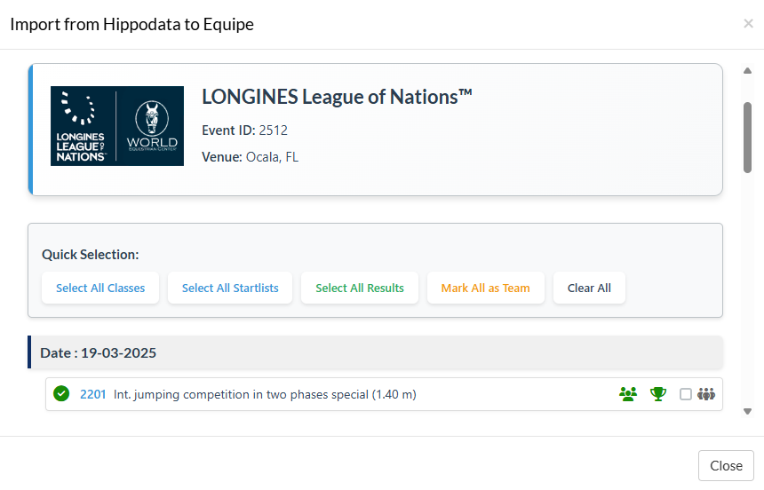

# Equipe Extension - Hippodata Import

This extension allows importing competitions, start lists and results from the Hippodata API to Equipe.

## Features

- **Import competitions/classes**: Import events with their information (prize money, dates, FEI articles)
- **Import startlists**: Import riders, horses and entries
- **Import results**: Import complete results with times, faults and rankings
- **Team competitions support**: Full support for Nations Cup and team events
- **Import status checking**: Visual indicators for already imported data
- **FEI Article management**: Select competition format according to FEI rules
- **Flexible import**: Import separately or in combination
- **Smart duplicate management**: Avoids duplication of existing riders and horses
- **Multi-round support**: Handles up to 5 rounds per competition
- **Special status handling**: Eliminated, retired, withdrawn, abstained riders
- **Debug mode**: Detailed operation display for troubleshooting

## ✅ Completed Features (as of 09/08/2025)

- ✅ **FEI Article management**: Full list of FEI competition formats
- ✅ **Team competitions**: Automatic team creation based on nations (minimum 3 riders)
- ✅ **Import status indicators**: Green checkmarks for already imported items
- ✅ **Enhanced results handling**: Support for abstained riders in team competitions
- ✅ **Country name mapping**: IOC codes mapped to full country names

## TODO
- **FEI Article Management**

## Installation

### 1. Prerequisites

- PHP >= 7.4
- Composer
- Web server with HTTPS (required for iframe cookies)
- Equipe account with API access
- Hippodata API access with Bearer token

### 2. Install dependencies

```bash
composer install
```

### 3. Configuration

1. Copy the `.env.php.example` file to `.env.php`
```bash
cp .env.php.example .env.php
```

2. Edit `.env.php` and add your keys:
```php
<?php
return [
    'EQUIPE_SECRET' => 'your-equipe-jwt-key',
    'HIPPODATA_BEARER' => 'your-hippodata-bearer-token',
    'DEBUG' => '0' // Set to '1' to enable debug mode
];
```

### 4. File structure

```
/
├── index.php                 # Main entry point
├── composer.json            # PHP dependencies
├── .env.php.example         # Configuration template
├── .env.php                 # Configuration (create, ignored by git)
├── css/
│   └── custom.css          # Custom styles (optional)
└── vendor/                  # Dependencies (generated by composer)
```

## Equipe Configuration

### 1. Create the extension in Equipe

1. Go to organization settings
2. Create a new extension
3. Configure:
   - **Base URL**: `https://your-domain.com/path-to-extension/`
   - **JWT Secret**: Generate and copy to `.env.php`
   - **Type**: Modal/Browser

### 2. Add actions

Create an action:
- **Name**: `import_from_hippodata`
- **Label**: "Import from Hippodata"
- **Context**: Meeting
- **Type**: Modal or Browser

## Usage

### Import Interface

- In Equipe, open a meeting
- Click on "Import from Hippodata" action
- In the window that opens:
  - Enter the FEI Show ID (Event identifier)
  - Click "Search Event"
  - The system will display:
    - Event name and venue
    - List of all classes/competitions
    - Import status for each item (✓ = already imported)

### Import Options

- For each class, you can select:

  - ☐ Class Import: Import the competition definition
  - ☐ Startlist Import: Import riders, horses and entries
  - ☐ Result Import: Import competition results
  - ☐ Team Class: Mark as team competition (Nations Cup)
  - FEI Article: Select the competition format

- Team Competitions
  - When "Team Class" is checked:
    - Automatically creates teams based on nations
    - Only nations with 3+ riders get a team
    - Creates clubs with country flags
    - Links riders to their national teams
    - Handles team-specific results (abstained riders count for team)

- Import Status Indicators
  - ✓ Green checkmark: Already imported
  - Checkbox: Available for import
  - Disabled checkbox: Requires prerequisite (e.g., class must exist before startlist)

### Special Results Handling
  - Individual Competitions
    - Eliminated (EL): or = 'D', grundf = 999
    - Retired (RET): or = 'U', grundf = 999
    - Disqualified (DSQ): or = 'S', grundf = 999
    - Withdrawn: a = 'Ö' or special handling per round
    - No Show (NS): a = 'U', grundf = 999

  - Team Competitions
    - Riders who complete round 1 but not round 2 are marked as "Abstained"
    - Abstained riders: omh1f = 999, omh1t = 999, round2_in_team = true
    - Result preview shows: "8-ABST" (faults from round 1 + abstained)
    - Eliminated/retired riders keep their normal status (not converted to abstained)


### Possible Combinations

- ✅ **Classes only**: To prepare the meeting
- ✅ **Startlists only**: If classes already exist
- ✅ **Results only**: To update after competition
- ✅ **Classes + Startlists**: Complete import before competition
- ✅ **Classes + Results**: Import after with results
- ✅ **Startlists + Results**: Complete update
- ✅ **Everything**: Complete import at once

## Data Mapping

### Competitions
| Hippodata | Equipe | Description |
|-----------|---------|-------------|
| ID | foreign_id | Unique identifier |
| NR | - | Class number (used for APIs) |
| NAME/SPONSOR | klass | Competition name |
| DATE | datum | Competition date |
| PRIZE.MONEY | prsum1 | Total prize money |
| PRIZE.CURRENCY | premie_curr | Currency |

### Riders
| Hippodata | Equipe | Description |
|-----------|---------|-------------|
| RFEI_ID | foreign_id/fei_id | FEI identifier |
| RNAME | first_name, last_name | Name (parsed) |
| NATION | country | Country |

### Horses
| Hippodata | Equipe | Description |
|-----------|---------|-------------|
| HFEI_ID | foreign_id/fei_id | FEI identifier |
| HNAME | name | Horse name |
| HNR | num | Number |
| GENDER | sex | Gender (M→val, F→sto, G→val) |
| BORNYEAR | born_year | Birth year |
| OWNER | owner | Owner |

### Results
| Hippodata | Equipe | Description| 
| RANK | re| Final ranking | 
| FAULTS R1 | grundf | Round 1 faults |
| TIME R1 | grundt | Round 1 time | 
| FAULTS R2 | omh1f | Round 2/Jump-off faults | 
| TIME R2 | omh1t | Round 2/Jump-off time | 
| TIMEFAULTS | tfg, tf1, etc. | Time penalties per round | 
| PRIZE.MONEY | premie | Prize money won | 
| STATUS | or, a | Special status | 
| - | round1_in_team | Counts for team in R1 | 
| - | round2_in_team | Counts for team in R2 | 
| - | result_preview | Display format (e.g., "8-ABST")| 

### Import Process Flow

- Search Event: Fetch event data from Hippodata
- Check Existing: Query Equipe for already imported items
- Display Selection: Show classes with import status
- Process Selection:
  - Import classes (if selected)
  - Import clubs (for team competitions)
  - Import people and horses
  - Import teams (for team competitions)
  - Import starts/entries
  - Import results (if selected)

## Debug Mode

Enable debug mode in `.env.php`:
```php
'DEBUG' => '1'
```

- This displays:
  - API requests made
  - Data received and sent
  - Transaction UUIDs for rollback
  - Team creation details
  - Import progress for each batch

- Batch Import Structure
  - The extension uses Equipe's batch API with proper ordering:
    - Classes/Competitions
    - Clubs (for teams)
    - People & Horses
    - Teams
    - Starts/Entries
    - Results

- Each batch uses a unique transaction UUID for potential rollback.

## Security

- JWT verification on each request
- Tokens stored outside source code
- HTTPS required for iframe cookies
- Input data validation
- CORS headers configured for app.equipe.com

## Troubleshooting

### Extension doesn't load

Check:
- HTTPS enabled on your server
- CORS configuration in index.php
- Correct JWT token in .env.php

### "FEI ID is required"

The FEI event identifier is mandatory. Format: integer number.

### Import status not showing

- Check API key permissions for GET requests
- Verify meeting URL is correct
- Enable debug mode to see API responses

### Teams not created

- Ensure "Team Class" checkbox is selected
- Verify nation has 3+ riders
- Check clubs endpoint is accessible

### Hippodata authentication error

Check:
- Bearer token in `.env.php`
- Token validity and permissions
- Format: `Bearer YOUR_TOKEN`

### Partial import

If some competitions don't import:
- Check logs in debug mode
- Some classes may not have startlist/results
- Check competition status (official, cancelled, etc.)

### Duplicate riders/horses

The extension automatically avoids duplicates by checking:
- The `foreign_id` (FEI ID)
- The `fei_id` field
If duplicates appear, verify that FEI IDs are correct.

### Results showing incorrect status

- Abstained: Only for team competitions when rider doesn't start later rounds
- Eliminated/Retired: Keep their original status, not converted to abstained
- Check RESULTTOTAL.TEXT field in Hippodata response

## API Endpoints Used

### Hippodata
- `/scoring/event/{eventId}`: Event information
- `/scoring/event/{eventId}/startlist/{classNr}/all`: Start lists
- `/scoring/event/{eventId}/resultlist/{classNr}`: Results

### Equipe

- `JWT decoded->palyload->meeting_url/batch`: Bulk import
- `JWT decoded->palyload->meeting_url/people.json`: Existing people
- `JWT decoded->palyload->meeting_url/horses.json`: Existing horses
- `JWT decoded->palyload->meeting_url/clubs.json`: Existing clubs
- `JWT decoded->palyload->meeting_url/competitions.json`: Existing competitions
- `JWT decoded->palyload->meeting_url/competitions/{id}/starts.json`: Check startlists
- `JWT decoded->palyload->meeting_url/competitions/{id}/H/results.json`: Check results
## Support

For any questions or issues:
- Jumpingaccess Support: info@jumpingaccess.com
- Server logs for PHP errors
- Debug mode to trace operations