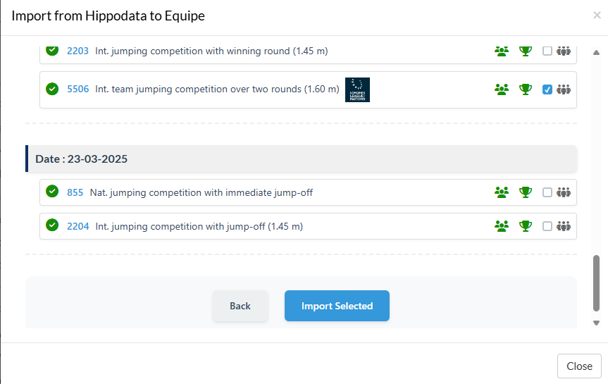

# Equipe Extension - Hippodata Import

## 🏇 Project Overview

This project is an extension for the **Equipe** competition management system that enables seamless import of equestrian competition data from the **Hippodata API** (FEI event data). It bridges the gap between FEI's official competition data and local competition management systems.

### Key Features

- 🏆 **Competition Import**: Import complete event structures with prize money, dates, and FEI articles
- 👥 **Startlist Management**: Import riders, horses, and entries with automatic duplicate detection
- 📊 **Results Processing**: Import complete results including times, faults, and special statuses
- 🌍 **Team Competition Support**: Full support for Nations Cup and team events with automatic team creation
- ✅ **Smart Import Status**: Visual indicators for already imported data
- 🔄 **Flexible Import Options**: Import data separately or in combination based on needs

## 🛠️ Available Implementations

The extension is available in two implementations:

### 1. PHP Version (`/php`)
- **Technology**: PHP 7.4+ with Composer
- **Architecture**: Procedural PHP with jQuery frontend
- **Deployment**: Simple web hosting with HTTPS
- **Best for**: Quick deployment, shared hosting environments

### 2. Rails Version (`/rails`)
- **Technology**: Ruby on Rails 7.0+ with PostgreSQL
- **Architecture**: MVC with service objects and RESTful API
- **Deployment**: Full Rails application deployment
- **Best for**: Enterprise environments, advanced customization needs

Both versions provide identical functionality and user experience.

## 📋 How It Works

### Integration Flow

```
Equipe System
     ↓
JWT Token (includes meeting info)
     ↓
Extension (PHP/Rails)
     ↓
Hippodata API
     ↓
Data Transformation
     ↓
Equipe Batch API
```

### User Workflow

1. **Access**: User opens extension from within Equipe meeting interface
2. **Search**: Enter FEI Event ID to fetch competition data
3. **Select**: Choose which competitions and data types to import
4. **Configure**: Set team flags and FEI articles as needed
5. **Import**: Process data with real-time progress tracking
6. **Complete**: Review import results and status

## 🚀 Quick Start

### PHP Version

```bash
# Clone repository
git clone <repository-url>
cd PHP

# Install dependencies
composer install

# Configure environment
cp .env.php.example .env.php
# Edit .env.php with your API keys

# Deploy to web server with HTTPS
```

### Rails Version

```bash
# Clone repository
git clone <repository-url>
cd rails

# Install dependencies
bundle install

# Configure environment
cp .env.example .env
# Edit .env with your API keys

# Setup database
rails db:create
rails db:migrate

# Start server
rails server
```

## 🔧 Configuration

### Required API Keys

1. **Equipe JWT Secret**: Provided when creating extension in Equipe
2. **Hippodata Bearer Token**: API access token from Hippodata

### Equipe Extension Setup

1. Log into Equipe as administrator
2. Navigate to Organization Settings → Extensions
3. Create new extension with:
   - **Type**: Modal or Browser
   - **Context**: Meeting
   - **URL**: Your deployment URL
   - **JWT Secret**: Copy to your configuration

## 📊 Data Mapping

### Competition Classes
- FEI Event → Equipe Competition
- Support for all FEI articles and competition formats
- Prize money and currency conversion
- Team competition flags

### Participants
- **Riders**: FEI ID mapping with country codes
- **Horses**: Gender mapping, birth year, ownership
- **Teams**: Automatic creation for nations with 3+ riders

### Results
- Multi-round support (up to 5 rounds)
- Special statuses: Eliminated, Retired, Withdrawn, etc.
- Team-specific handling (abstained riders)
- Time penalties and prize money allocation

## 🎯 Import Options

The extension supports flexible import combinations:

| Option | Use Case |
|--------|----------|
| Classes Only | Prepare meeting structure |
| Startlists Only | Update participants for existing classes |
| Results Only | Import results after competition |
| Classes + Startlists | Complete pre-competition setup |
| Classes + Results | Post-competition import |
| Full Import | Complete event import |

## 🏆 Team Competition Features

- Automatic team detection based on rider count
- Country flag assignment for teams
- Team-specific result handling
- Support for Nations Cup formats
- Abstained rider management

## 🔍 Debug Mode

Enable debug mode for detailed operation logging:

**PHP**: Set `DEBUG => 1` in `.env.php`  
**Rails**: Set `DEBUG=1` in `.env`

## 📝 Version Comparison

| Feature | PHP Version | Rails Version |
|---------|-------------|---------------|
| Core Functionality | ✅ Full | ✅ Full |
| Installation Complexity | ⭐ Simple | ⭐⭐⭐ Complex |
| Server Requirements | PHP 7.4+ | Ruby 3.2+, PostgreSQL |
| Scalability | ⭐⭐ Good | ⭐⭐⭐ Excellent |
| Maintenance | Simple files | Rails ecosystem |
| Customization | Direct PHP edits | Rails conventions |
| Performance | ⭐⭐ Good | ⭐⭐⭐ Excellent |

## 🛡️ Security

- JWT token validation on all requests
- API keys stored in environment variables
- HTTPS required for production
- CORS protection configured
- Input validation and sanitization

## 🤝 Support

For technical support or questions:
- **Email**: info@jumpingaccess.com
- **Documentation**: See version-specific README files
- **Issues**: Use GitHub issues for bug reports

## 📄 License

This project is developed for Equipe integration with the agreement of Hippodata GMBH. Contact for more information.

## 🔄 Updates

### Latest Version (January 2025)
- ✅ Full team competition support
- ✅ Enhanced result status handling
- ✅ Import status indicators
- ✅ FEI article management
- ✅ Country name mapping

### Roadmap
- [ ] Bulk event import
- [ ] Schedule synchronization
- [ ] Live result updates
- [ ] Export functionality

---

**Note**: Choose the implementation that best fits your infrastructure and requirements. Both versions are actively maintained and provide identical functionality.